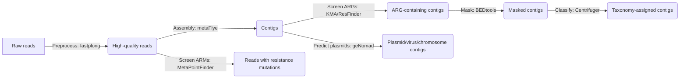

# MEGAISurv Namaste :pray:

[](https://www.repostatus.org/#active) [](https://opensource.org/licenses/BSD-3-Clause)  [](https://utrechtuniversity.github.io/MEGAISurv-Namaste/)  [](https://deepwiki.com/UtrechtUniversity/MEGAISurv-Namaste)

**Namaste**: Nanopore Metagenomics antibiotic Resistance and Taxonomy Screening
for the project MEGAISurv:

**ME**ta**G**enome-informed **A**ntimicrobial res**i**stance **Surv**eillance:
Harnessing long-read sequencing for an analytical, indicator and risk assessment
framework.

For more detailed documentation, please look at the
[project website](https://utrechtuniversity.github.io/MEGAISurv-Namaste/index.html).
Here you also find the
[user manual](https://utrechtuniversity.github.io/MEGAISurv-Namaste/manual.html),
which includes a quick start guide as well as a detailed step-by-step description.
Or look at the computer-generated Wiki with integrated chatbot assistant at
[DeepWiki](https://deepwiki.com/UtrechtUniversity/MEGAISurv-Namaste)!

## Index

1. [Workflow description](#workflow-description)
    - [microbiota profiling](#microbiota-profiling)
    - [future ideas](#future-ideas)
2. [Project (file) organisation](#project-organisation)
3. [Licence](#licence)
4. [Citation](#citation)

## Workflow description



### Simple description

Input: long-read metagenomes generated on a Nanopore platform.
Also works with PacBio SMRT metagenomes.

1. Metagenomic reads are preprocessed using [fastplong](https://github.com/OpenGene/fastplong) (version 0.2.2)

2. High-quality reads are screened for antibiotic resistance mutations using [MetaPointFinder](https://github.com/aldertzomer/metapointfinder) (version 1.01)

3. High-quality reads are assembled using [metaFlye](https://github.com/mikolmogorov/Flye) (version 2.9.2)

    - Assembly stats are calculated using [metaQUAST](https://quast.sourceforge.net/quast) (version 5.3.0) and [seqkit](https://bioinf.shenwei.me/seqkit/) (version 2.9.0)
    - High-quality reads are mapped back to contigs to calculate coverage using [minimap2](https://github.com/lh3/minimap2) (version 2.30) and [samtools](https://www.htslib.org/) (version 1.22.1)
        - This is also used to match the resistance mutations in reads to contigs

4. Antibiotic resistance genes are identified using [KMA](https://github.com/genomicepidemiology/kma) (version 1.4.2)

    - This uses the [ResFinder Database](https://bitbucket.org/genomicepidemiology/resfinder_db/src/master/);
      a script is included to download the latest version: [scripts/prepare_resfinder.sh](scripts/prepare_resfinder.sh)

5. Resistance genes are masked using [BEDtools](https://bedtools.readthedocs.io/en/latest/index.html) (function `maskFastaFromBed`; version 2.31.1)

6. Assembled and masked contigs are taxonomically classified using [Centrifuger](https://github.com/mourisl/centrifuger) (version 1.0.6)

    - For this we use the default settings, as well as extra strict settings `--min-hitlen 100` to reduce false-positives based on short matches

    - Taxon IDs are converted to their respective names using [TaxonKit](https://bioinf.shenwei.me/taxonkit/) (version 0.18.0)

7. Contigs are also classified as chromosome/plasmid/virus based on the predictions by [geNomad](https://portal.nersc.gov/genomad/) (version 1.8.0)

The results from KMA+ResFinder, Centrifuger+TaxonKit and geNomad are combined in a tab-separated text file (dataframe)
for downstream processing (for example in R). Results for MetaPointFinder are similarly combined with their respective
contig annotations (assembly statistics, taxonomy, plasmid predictions) and saved as tab-separated text file.

Also see the [documentation on output files](https://utrechtuniversity.github.io/MEGAISurv-Namaste/output_files.html).

**(Under construction: 🚧)**

As additional taxonomic classification, and verification of results produced by Centrifuger, assembled contigs are binned using:

- [SemiBin2](https://semibin.readthedocs.io/en/latest/) (version 2.2.0)
- [MetaBAT2](https://bitbucket.org/berkeleylab/metabat) (version 2.18)
- [VAMB](https://vamb.readthedocs.io/en/latest/index.html) (version 5.0.4)

The plan is to assess each of these with [CheckM2](https://github.com/chklovski/CheckM2),
select the most complete/least contaminated bins for each sample using
[dRep](https://drep.readthedocs.io/en/latest/), and then classify these 'curated bins' with
[GTDB-Tk](https://ecogenomics.github.io/GTDBTk/).
These classifications are then added to the combined dataframe to facilitate comparison to
Centrifuger's classifications.

These steps are not automatically run with the workflow and may be enabled later as an extra feature.

### Microbiota profiling

#### Taxonomic assignment and quantification

For the taxonomic classification of the metagenomes (also known as microbiota profiling),
we are using the metagenomic assemblies generated by Flye and classify them with
Centrifuger. As Centrifuger expects reads rather than contigs, the relative
abundances need to be manually adjusted. To do this, we use the contig length
and depth of coverage as reported in the assembly statistics provided by Flye.
File `assembly_info.txt`. With this we calculate the total number of bases
assigned to each taxon and from that we calculate the percentage assigned to
each species.

Also, Centrifuger does not report taxon names per read/contig automatically.
Instead, it provides the tax IDs as reported in the NCBI taxonomy database.
To translate these to species names and complete taxonomic lineages, we use
[TaxonKit](https://bioinf.shenwei.me/taxonkit) (version 0.18.0) with the
NCBI taxdump (ftp://ftp.ncbi.nih.gov/pub/taxonomy/taxdump.tar.gz)
downloaded automatically within the workflow.

The practical implementation of this workflow is described in the
[`Snakefile`](workflow/Snakefile) and is as follows:

1. Classify contigs using Centrifuger with the 'cfr_hpv+sarscov2' database
(Which is available on [Zenodo](https://zenodo.org/records/10023239))

2. Attach species and taxon lineage names using TaxonKit

3. Quantify by combining Centrifuger's output and coverage statistics by minimap2 +
samtools coverage in a custom R script. (I.e., for each contig, multiply its
length with its depth to represent 'total_bases', then calculate percentages per
contig and per taxon based on these total_bases.)

#### GTDB-Tk user note

GTDB-Tk requires its database to be downloaded and referenced to work.
You can run the Snakemake workflow without setting this up first,
but then the rule `classify_bins` will likely fail and present an error.
If you already have a working GTDB-Tk installation outside of Namaste,
you can use:

```bash
grep "gtdbtk" .snakemake/conda/*yaml # find the environment with gtdbtk in it
mamba activate .snakemake/conda/[env_name]
# Below is an example command, fill in the correct path to your environment!
conda env config vars set GTDBTK_DATA_PATH="~/miniforge3/env/gtdbtk/share/gtdbtk-2.5.2/db"

# If you have not downloaded the database before, change the last command to this :
download-db.sh # to download the database.

mamba deactivate
```

(See the [GTDB-Tk user manual](https://ecogenomics.github.io/GTDBTk/installing/bioconda.html#installing-bioconda).)

## Manual intervention

### Failing assemblies

Although the workflow is automated, it is possible that it gets stuck at certain points.
One is the assembly: a sample may not have enough reads to successfully assemble.
In such a case, Snakemake will return an error for that particular sample
and will not be able to complete the whole workflow. To exclude samples from
further analysis if no assembly can be produced, a helper script has been provided.
If Snakemake was installed using mamda, you can run:

```bash
python3 scripts/exclude_failed_assemblies.py
```

To automatically identify samples for which no assembly could be produced
and move their respective reads to the subdirectory `cannot_assemble`.
By doing this, Snakemake will no longer see them as input samples and
can then successfully complete the workflow.

## Future ideas

### Improve existing workflow

- **Write/extend documentation of the whole workflow and interesting findings**

  - Document ARG identification process (currently includes R script to parse KMA and include only hits that cover >=60% of the reference ARG)

- Include downstream processing scripts (RMarkdown) for statistical analyses
and visualisationu

- Calculate per-sample and overall fraction of contigs with ARGs: what is the estimated prevalence of ARGs?

## Project organisation

```bash
.
├── CITATION.cff
├── LICENSE
├── README.md
├── config             <- Configuration of Snakemake workflow
├── data               <- Suggested input directory for metagenomic reads
├── doc                <- Project documentation, notes and experiment records
├── log                <- Log files from programs
├── resources          <- Databases downloaded/generated by the workflow
├── results            <- Workflow output
└── workflow           <- Snakemake workflow files
    ├── envs           <- Conda environments (software dependencies)
    ├── notebooks      <- RMarkdown/Jupyter notebooks with statistical analyses and figures
    ├── rules          <- Modules of the workflow
    ├── scripts        <- Scripts used by the workflow
    └── Snakefile      <- The main workflow file
```

## Licence

This project is licensed under the terms of the [New BSD licence](LICENSE).

## Citation

Please cite this project as described in the [citation file](CITATION.cff).
